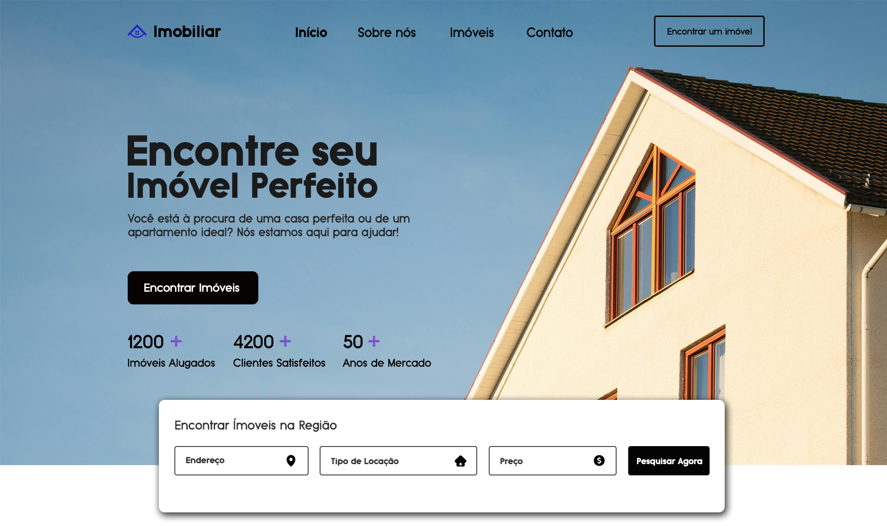

# Site para Imobiliária com Nextjs e NodeJs

Bem-vindo ao projeto Fullstack Imobiliária! Este é um sistema completo para gestão de imóveis, oferecendo uma interface intuitiva para administradores e usuários finais. O projeto é desenvolvido usando NextJs e NodeJs.

## Funcionalidades

- Manipulação e edição de publicações (CRUD).
- Login para usuário admin protejido.
- UI Responsiva e Intuitiva.
- Editor intuitivo para cadastro de novos imóveis.